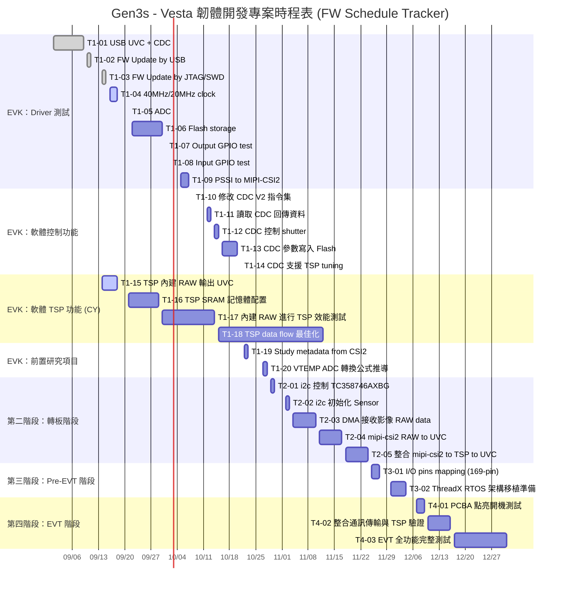

```mermaid
gantt
    title Gen3s - Vesta 韌體開發專案時程表 (FW Schedule Tracker)
    dateFormat  YYYY-MM-DD
    axisFormat  %m/%d
    todayMarker stroke-width:2px,stroke:#dc2626,opacity:0.8

    section EVK：Driver 測試
    T1-01 USB UVC + CDC               :done,    m01, 2026-09-01, 2026-09-09
    T1-02 FW Update by USB            :done,    m02, 2026-09-10, 2026-09-11
    T1-03 FW Update by JTAG/SWD       :done,    m03, 2026-09-14, 2026-09-15
    T1-04 40MHz/20MHz clock           :active,  m04, 2026-09-16, 2026-09-18
    T1-05 ADC: read VTEMP             :         m05, 2026-09-21, 2026-09-21
    T1-06 Flash storage: NUC table    :         m06, 2026-09-22, 2026-09-30
    T1-07 Output GPIO test            :         m07, 2026-10-01, 2026-10-01
    T1-08 Input GPIO test             :         m08, 2026-10-02, 2026-10-02
    T1-09 PSSI to MIPI-CSI2           :         m09, 2026-10-05, 2026-10-07

    section EVK：軟體控制功能
    T1-10 修改 CDC V2 指令集          :         c01, 2026-10-08, 2026-10-08
    T1-11 讀取 CDC 回傳資料           :         c02, 2026-10-12, 2026-10-13
    T1-12 CDC 控制 shutter            :         c03, 2026-10-14, 2026-10-15
    T1-13 CDC 參數寫入 Flash          :         c04, 2026-10-16, 2026-10-20
    T1-14 CDC 支援 TSP tuning         :         c05, 2026-10-21, 2026-10-21

    section EVK：軟體 TSP 功能 (CY)
    T1-15 TSP 內建 RAW 輸出 UVC       :active,  tsp1, 2026-09-14, 2026-09-18
    T1-16 TSP SRAM 記憶體配置         :         tsp2, 2026-09-21, 2026-09-29
    T1-17 內建 RAW 進行 TSP 效能測試  :         tsp3, 2026-09-30, 2026-10-14
    T1-18 TSP data flow 最佳化        :         tsp4, 2026-10-15, 2026-11-12

    section EVK：前置研究項目
    T1-19 Study metadata from CSI2    :         r01, 2026-10-22, 2026-10-23
    T1-20 VTEMP ADC 轉換公式推導      :         r02, 2026-10-27, 2026-10-28

    section 第二階段：轉板階段
    T2-01 i2c 控制 TC358746AXBG       :         tb1, 2026-10-29, 2026-10-30
    T2-02 i2c 初始化 Sensor           :         tb2, 2026-11-02, 2026-11-03
    T2-03 DMA 接收影像 RAW data       :         tb3, 2026-11-04, 2026-11-10
    T2-04 mipi-csi2 RAW to UVC        :         tb4, 2026-11-11, 2026-11-17
    T2-05 整合 mipi-csi2 to TSP to UVC:         tb5, 2026-11-18, 2026-11-24

    section 第三階段：Pre-EVT 階段
    T3-01 I/O pins mapping (169-pin)  :         p01, 2026-11-25, 2026-11-27
    T3-02 ThreadX RTOS 架構移植準備   :         p02, 2026-11-30, 2026-12-04

    section 第四階段：EVT 階段
    T4-01 PCBA 點亮開機測試           :         evt1, 2026-12-07, 2026-12-09
    T4-02 整合通訊傳輸與 TSP 驗證     :         evt2, 2026-12-10, 2026-12-16
    T4-03 EVT 全功能完整測試          :         evt3, 2026-12-17, 2026-12-31
```
